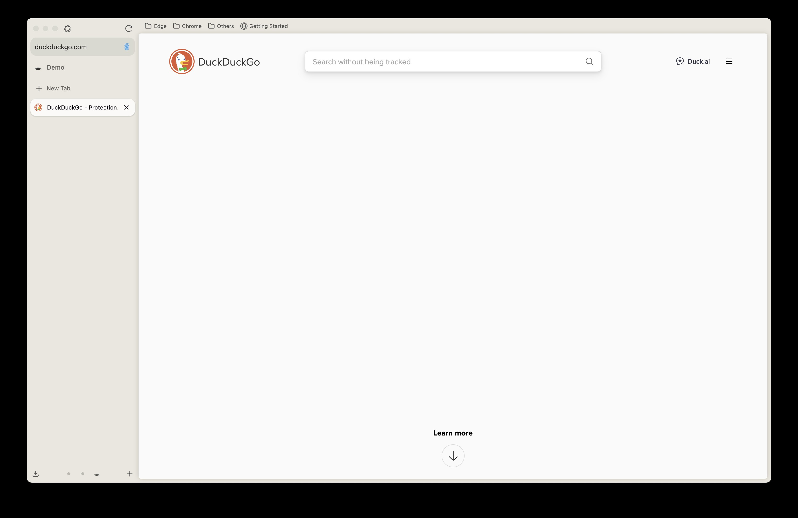
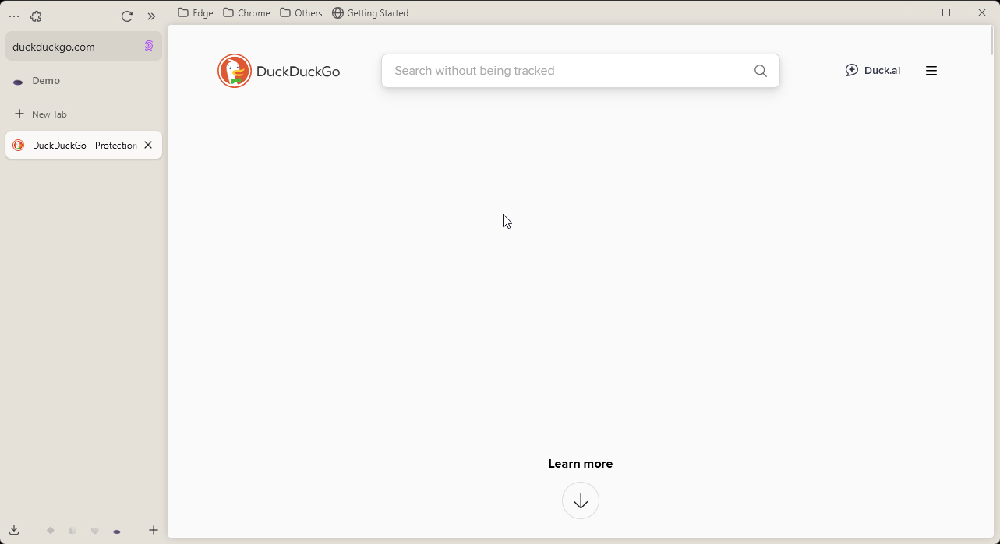

  <h2 align="center">
    Always show bookmarks bar - Zen Browser Mod
  </h2>

  

    Keep showing bookmarks bar for <b>Single Toolbar mode</b> when Bookmarks Toolbar is set to Always show
  

Toggle the bookmarks bar visibility using the keyboard shortcut:

`Ctrl + Shift + B` or `⌘ + ⇧ + B` (Browser default)

The shortcut can be changed through **Settings > Keyboard Shortcuts > Other > Show Bookmarks Toolbar**.

<h3 align="center">
Screenshot
</h3>
  <picture>
    
  </picture>
    <picture>
    
  </picture>

